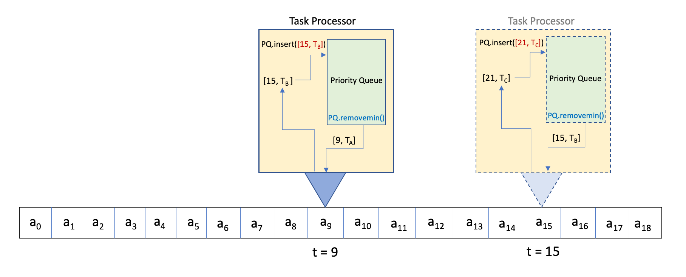

# Mod 10 Homework: Discrete Event Simulation
## Goal

In this assignment you will create simulations following the Discrete Event Simulation paradigm. Priority queues are heavily used in such simulations as they offer functionality that is very handy when queueing tasks for execution at prescribed times in the future: 



We provide data structures for the priority queue and the Tasks that will be scheduled to process - your work will be on using these data structures to construct simulations.

## The Setting

We have a tape with integer entries `a0, a1, ...` that is scanned from left to right starting at time `t=0`. Each entry is processed in exactly one unit of time, so the index of an entry is always equal to the time at which it is worked on.

A CPU processes all tasks scheduled for a given time using a priority queue, and may add tasks to be processed at future (or even the current!) time steps. The "processing" for each task is simple in this assignment - we either multiply the number on the tape by some constant, or do nothing.

All created tasks are put on a min-priority queue (provided). The keys are the scheduled times of execution, the values are `Task` objects (also provided). At any given time `t`, the processor executes all the tasks scheduled for that time by calling `removemin()` on the priority queue until there are no tasks left for time `t`.

In the illustration above, the processor looks at entry 9 (`t = 9`) and executes task `T_A` scheduled for that time. Afterwards, the processor enqueues a new task `T_B` for time `15` based on the rules of this simulation.

Later, at time `t=15`, the task `T_B` is executed on entry `a_15`, and a new task is enqueued for execution at time `21` (we can guess the simulation rule now - after processing a task, add another task at time `t+6`). Note that the processor enqueues key:value pairs of the form `[t, T]` where `t` is the scheduled time (the key) and `T` is the task to be executed (the value).

You probably realize at this point why such simulations are helpful (or even necessary): as the processor scans the tape it could accumulate tasks on its queue with very irregular execution times. It could be very difficult to predict what tasks will be executed at any given time. If the new tasks are based on the result of the tasks just executed, determining the final tape content after all these operations could be mathematically intractable.

## Tasks

Our tasks will perform an operation on a given entry if a given condition is satisfied:

```python
class Task:
    def __init__(self, operation, condition):
        self.multiplier = operation
        self.multiplicity = condition
```

In this assignment, the operation will always be multiplication and the condition will always be multiplicity:

* operation - an integer to multiply the current entry by if
* condition - the current time is a multiple of this integer 

For instance, `T = Task(-1, 3)` is a task that would multiply the current entry by `-1` if the current time was a multiple of `3` (0, 3, 6, 9, ...). Note that the condition may sometimes be false, so a Task may not multiply the current entry by it's multiplier (`T` would do nothing at time `2`).

A task is executed by calling the `execute` method on itself:

```python
class Task:
    ...
    def execute(self, L,  time):          # L is the tape; time is the index into L
            if time % self.multiplicity == 0:
                L[time] *= self.multiplier

```

We also define the the `__repr__` magic method to make it easy to print a list of `Tasks` (Python calls `repr` on each element when printing a list):

```python
class Task:
    ...
    def __repr__(self):
        return "Operation: multiply by = " + str(self.multiplier) + ", " + \ 
            "condition: time is multiple of  " + str(self.multiplicity)  + '\n'
```

## The Priority Queue

The priority queue implementation used for this assignment, `HeapPQ` (see `'TaskSimulator.py`) is essentially the same as that described in the textbook, except modifications were made in order to enqueue pairs of the form `[time, task]`.

## Example

Below is an example of a simulation where the final state of the tape can be easily predicted (note that we return the tape and the task queue at the end of each function).

```python
from TaskSimulation import Task, HeapPQ

def example_simulation1():
    TQ = HeapPQ()                   # Creating empty priority queue
    N = 100
    TAPE = list(range(N))           # Our tape has entries 0, 1, 2, ..., 99

    t0 = Task(-1, 3)                # Multiplies by -1 if t divisible by 3
    TQ.insert(0, t0)                # Add first task to queue

    for t in range(N):              # This loop processes the table entry by entry
        
        tt, task = TQ.findmin()     # Grab the next task

        # Process all tasks scheduled for this time
        while task is not None and tt == t:
            task.execute(TAPE, t)   # execute task
            TQ.removemin()          # remove task

            # Simulation rule: reinsert the task at a future time
            next_time = tt + task.multiplicity 
            TQ.insert(next_time, task)

            
            tt, task = TQ.findmin() # Grab the next task

    return TAPE, TQ
```

Here is the output:

```
TAPE AFTER PROCESSING:
[0, 1, 2, -3, 4, 5, -6, 7, 8, -9, 10, 11, -12, 13, 14, -15, 16, 17, -18, 19, 20, -21, 22,
 23, -24, 25, 26, -27, 28, 29, -30, 31, 32, -33, 34, 35, -36, 37, 38, -39, 40, 41, -42,
 43, 44, -45, 46, 47, -48, 49, 50, -51, 52, 53, -54, 55, 56, -57, 58, 59, -60, 61, 62,
 -63, 64, 65, -66, 67, 68, -69, 70, 71, -72, 73, 74, -75, 76, 77, -78, 79, 80, -81, 82,
 83, -84, 85, 86, -87, 88, 89, -90, 91, 92, -93, 94, 95, -96, 97, 98, -99]

TASK QUEUE AFATER PROCESSING:
exec. time = 102,  Operation: multiply by = -1, condition: time is a multiple of  3
```

Now it is your turn to create some simulations. Remember, you should return the TAPE and the task queue at the end of the simulation.

## TODO: Simulation 1

Write a function `simulation1()` that takes no arguments and multiplies every entry on the tape by `-2`.

Start with an empty priority queue and a tape containing 100 entries: the sequence of numbers from `0` through `99`.

Add a single task to the TQ before beginning to process entries: "Multiply the first entry by -2." Then, after each entry is finished processing, re-add that task to the next time step to multiply that entry by -2. Think about what multiplicity should be used so that every time step will execute the task (what number is a factor of every integer?).

After the simulation, the function should return the processed tape and the task queue (which should have one task remaining).

## Another Example

In this example our tape is short as the numbers produced by the simulation become quickly very large. We do not process entry 0 and start with an empty task queue. Beginning with index 1, we enqueue a task for the next time step. The multiplier for that task is the current entry (post-processing).

Note that at all times at most one task is held on the queue. Note also that the multiplier in the enqueued tasks is no longer constant.

```Python
def example_simulation2():
    TQ = HeapPQ()           # PQ of tasks
    N = 10                  # length of tape
    TAPE = list(range(N))   # [0, 1, 2, ..., 9]

    for t in range(N):  # This will look at every entry of the TAPE one by one
        if t < 1:
            continue # ignore t=0

        tt, task = TQ.findmin() # Grab a task if any exist
        
        # while there are tasks to be executed at this
        # time, go ahead and do the work
        while task is not None and tt == t: 
            task.execute(TAPE, tt)  # execute task
            TQ.removemin()          # remove from PQ
            tt, task = TQ.findmin() # grab the next task

        # Create a a new task and add it to the PQ
        # Note - the condition is "multiple of 1", so this task should
        # be executed at any time
        task = Task(TAPE[t], 1)  # The multiplier is what we see on the tape
        next_time = t + 1
        TQ.insert(next_time, task)
        
    return TAPE, TQ
```

The output from this example is listed below. Can you guess what has been produced on the tape?

```
TAPE AFTER PROCESSING:
[0, 1, 2, 6, 24, 120, 720, 5040, 40320, 362880]

TASK QUEUE AFATER PROCESSING:
exec. time = 10,  Operation: multiply by = 362880, condition: time is a multiple of  1
```

## TODO: Simulation 2

Write a function `simulation2()` which takes no arguments and returns the processed tape together with the queue as in the previous examples.

* The length of the tape should be 10 (entries should be 0-9).
* Start with an empty task queue and do no processing for index 0.
* Beginning with `t=1`, insert a single new task after processing all tasks for the current time step (the first task should be processed at `t=2`).
    * execution time: the next time step (`t + 1`)
    * multiplier: index of the next entry to be processed, i.e., `t + 1`
    * multiplicity: as above, pick a factor so every time step can execute this task

After processing, the initial entries on the output tape should be `0, 1, 4`.

## TODO: Simulation 3

`simulation3()`: As above, but the multiplier of a task is the square of the index of the next entry to be processed (e.g. after `t = 1`, add a task with a multiplier of `2^2 = 4`).

The intial entries on the output tape should be `0, 1, 8`. Only one entry should be left on the queue after the simulation. Do you recognize the sequence you've just generated?

## TODO: Simulation 4

This and the next simulation are a bit more challenging to predict - new tasks may be generated at each entry, and their scheduled time, multiplier, and multiplicity will depend on the current entry.

`simulation4`

* Use a tape of length 100 (0-99)
* Start with an empty task queue
* No processing for entries 0 and 1
* Starting with entry 2:
    * execute each task `T` that is scheduled for that time and remove it from the queue
       * immediately after `T`'s removal, reinsert it into the queue with a new execution time. The new execution time should be `T.multiplicity` units later (e.g., if `T.multiplicity = 3`, the new execution time should be `t + 3`)

    * If the entry at index `t` is non-zero,
        * create a new task `T`. `T` should have multiplier `0` and condition (`multiplicity`) equal to the current entry
        * Add `T` to the queue with execution time `T.multiplicity` units of time later than the current time

* Return the processed tape, *but filter out all entries that are `<= 1`*. Return the queue as well. (e.g. if your entries are `[0, 2, 3, 1, 4]`, you should return `[2, 3, 4]` and the task queue).

Note: You should recognize the sequence in the filtered out numbers on the tape, and the tasks on the queue. There should be 25 tasks remaining.

## TODO: Simulation 5
 
`simulation5`

* Use a tape of length 100 (0-99)
* Start with the empty task queue
* Do not process entries 0 and 1
* Starting from `t = 2`,

    * Create a new task `T` with a `multiplier` of `-1` and a `multiplicity` equal to the current entry

    * Insert `T` into the queue with the execution time equal to current time (so it will be processed before moving to the next entry)

    * Now process all the tasks that are scheduled for this time. There is at least one such task - the one we've just inserted.
    
    * After processing each task `T`, re-insert it at a future time step - schedule it for `T.multiplicity` steps after `t` (e.g. if `multiplicity` is 3, schedule it for `t+3`


* Return the processed tape but filter out all entries that are <= -1. Return also the queue with the remaining tasks. You should be able to recognized the numbers on the tape.


## Submitting

Please submit two files:

* `TaskSimulation.py` (this file should not be modified, but needs to be submitted)
* `MySimulations.py` (your work will be here)

Students must submit to Mimir individually by the due date (typically, the Wednesday after this module at 11:59 pm EST) to receive credit.

## Grading

Note: we've hidden some of the test case input/outputs in Mimir to avoid giving away the expected sequence.

* 20 - `Simulation 1`
* 20 - `Simulation 2`
* 10 - `Simulation 3`
* 25 - `Simulation 4`
* 25 - `Simulation 5`


## Feedback
If you have any feedback on this assignment, please leave it [here](https://s.uconn.edu/cse2050_feedback).

We check this feedback regularly, and it has resulted in many improvements.